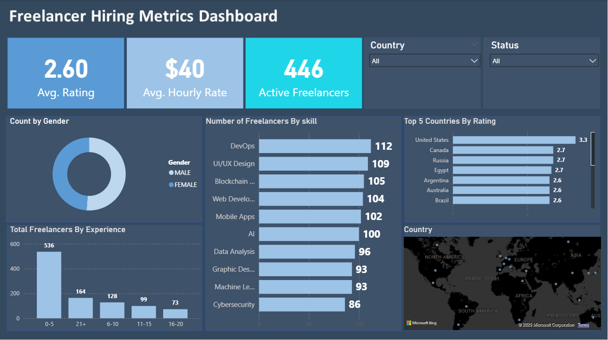

🌐 Global Freelancer Hiring Dashboard
This interactive and user-friendly dashboard is designed to provide data-driven insights for stakeholders to make informed hiring decisions in the global freelance market. By analyzing key performance and compensation metrics, it enables quick identification of top talent and emerging market trends.

📊 Dashboard Highlights
The dashboard focuses on the most important metrics for fast and effective talent assessment:

Average Rating: Measures overall quality and reliability of freelancers.

Average Hourly Rate: Provides insights into market pricing and compensation benchmarks.

Number of Active Freelancers: Shows the current supply and availability of talent.

Top Countries by Skill: Helps plan geographical sourcing strategies.

Top Freelancers by Experience: Highlights seasoned experts across various skills.

🛠️ Technologies & Data
The analysis is based on a cleaned dataset (global_freelancers_cleaned.csv) prepared in Excel and visualized using Power BI.

🖼️ Dashboard Screenshot

The image above shows the interactive Power BI dashboard, highlighting key KPIs, filters, and top-performing freelancers across skills and regions.
